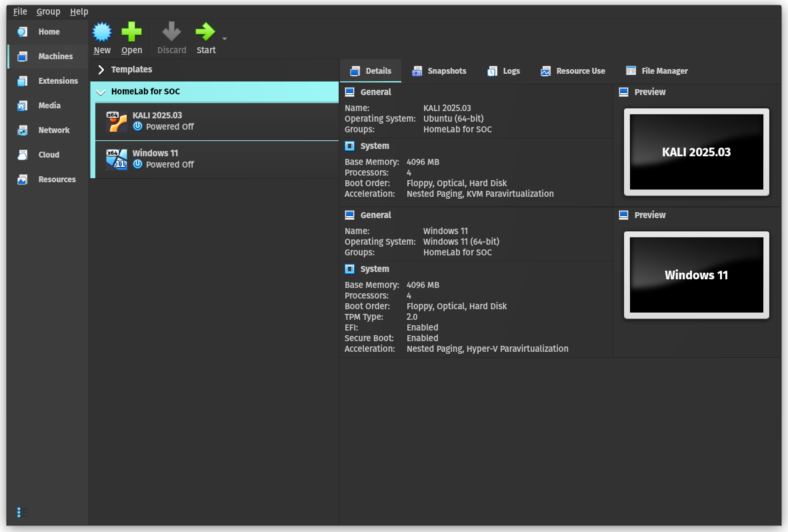

# HomeLab for SOC
> Creating a Sandboxed Environment using VirtualBox, Windows 11, and Kali Linux.

---

## 📌 Table of Contents

- [Overview](#overview)
- [Objectives](#objectives)
- [Lab Setup](#lab-setup)
- [Tools Used](#tools-used)
- [Step-by-Step Walkthrough](#step-by-step-walkthrough)
- [Key Security Concepts](#key-security-concepts)
- [Challenges & Lessons Learned](#challenges--lessons-learned)
- [Real-World Application](#real-world-application)
- [Artifacts & Resources](#artifacts--resources)
- [Conclusion](#conclusion)

---

## 🔍 Overview

Creating a Sandboxed Environment using VirtualBox to analyse logs generated by Sysmon and Windows11 using Splunk as SIEM. We will use Metasploit Framework to gerated an executable which will be executed on Window host with sysmon, ready to generate logs.

---

## 🎯 Objectives

- Understand **importance of logs** in security context.
- Build a **isolated** and **restorable** environment to test on.
- VirtualBox: Networking and Snapshot.
- Configuring Windows with Sysmon.
- Configuring Splunk (SIEM).

---

## 🛠️ Lab Setup

**Environment:**  
- Virtualization: VirtualBox
- Guest OS: Windows 11, Kali Linux.
- Network: NAT Network - all host on the same local network.

**Systems:**
- Windows 11 (Target)
- Parrot OS (Attacker)
- Ubuntu (SIEM)

---

## 🧰 Tools Used

| Tool        | Purpose                     |
|-------------|-----------------------------|
| Sysmon      | To Generate logs            |
| Splunk      | Log analysis                |
| msfconsole  | To generate payload         |
| VirtualBox  | As a Hypervisor             |

---

## 🔄 Step-by-Step Walkthrough

### PART A: Installing Guests Operating Systems
+ Download and Install the following:
    - VirtualBox on Guest OS.
    - Windows 11 iso
    - Kali Linux iso

> [!Note] 
> - To very the **checksum** of the files using `sha256sum <filename>`.
> - For VirtualBox we need to *add the host user to vboxusers group* using `usermod <USER> -aG vboxusers`

> [!Tips]
> - Use VirtualBox **snapshot** feature to save the installtion and use them as a templates.
> - Now you can create **linked clones** of the snapshots for different projects and group them.
> - Remember to change the MAC addresses of the clones.

### PART B: Configuring Networking, Sysmon, and Splunk
### PART C: Executing payload and Viewing Logs.

## Key Security Concepts
## Challenges & Lessons Learned
## Real-World Application
## Artifacts & Resources
## Conclusion
