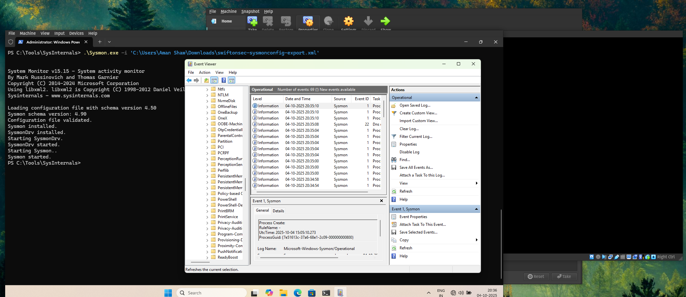
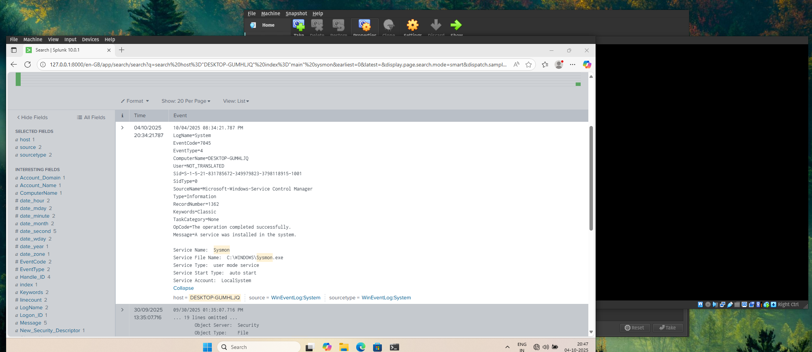
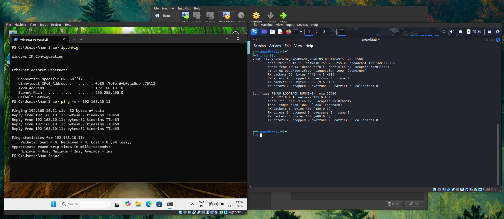

# HomeLab for SOC
> Creating a Sandboxed Environment using VirtualBox, Windows 11, and Kali Linux.

---
## 📌 Table of Contents

- [Overview](#overview)
- [Objectives](#objectives)
- [Lab Setup](#lab-setup)
- [Tools Used](#tools-used)
- [Step-by-Step Walkthrough](#step-by-step-walkthrough)
- [Key Security Concepts](#key-security-concepts)
- [Challenges & Lessons Learned](#challenges--lessons-learned)
---

## 🔍 Overview
Creating a Sandboxed Environment using VirtualBox to analyse logs generated by Sysmon and Windows11 using Splunk as SIEM. We will use Metasploit Framework to gerated an executable which will be executed on Window host with sysmon, ready to generate logs.

## 🎯 Objectives
- Understand **importance of logs** in security context.
- Build a **isolated** and **restorable** environment to test on.
- VirtualBox: Networking and Snapshot.
- Configuring Windows with Sysmon.
- Configuring Splunk (SIEM).

## 🛠️ Lab Setup
**Environment:**  
- Virtualization: VirtualBox
- Guest OS: Windows 11, Kali Linux.
- Network: NAT Network - all host on the same local network.

**Systems:**
- Windows 11 (Target)
- Parrot OS (Attacker)
- Ubuntu (SIEM)

## 🧰 Tools Used

| Tool        | Purpose                     |
|-------------|-----------------------------|
| Sysmon      | To Generate logs            |
| Splunk      | Log analysis                |
| msfconsole  | To generate payload         |
| VirtualBox  | As a Hypervisor             |

---

## 🔄 Step-by-Step Walkthrough

### PART A: Installing Guests Operating Systems
+ Download and Install the following:
    - VirtualBox on Guest OS.
    - Windows 11 iso
    - Kali Linux iso

> [!NOTE] 
> - To very the **checksum** of the files using `sha256sum <filename>`.
> - For VirtualBox we need to *add the host user to vboxusers group* using `usermod <USER> -aG vboxusers`

> [!TIP]
> - Use VirtualBox **snapshot** feature to save the installtion and use them as a templates.
> - Now you can create **linked clones** of the snapshots for different projects and group them.
> - Remember to change the MAC addresses of the clones.

---

### PART B: Configuring Network, Sysmon, and Splunk

#### Setting up Sysmon
- Installation
    - I downloaded the sysinternal suite and extracted them in C:\Tools\SysInternals
    - I downloaded [SwiftOnSecurity](https://github.com/SwiftOnSecurity/sysmon-config) config.
    - open admin powershell
    - `cd C:\Tools\SysInternals`
    - `.\Sysmon.exe -i <config_location>`
    - verify sysmon logs in the event viewer: Application and Services --> Windows --> Sysmon --> Operational.

#### Setting up Splunk
- Get Splunk Enterprise and install in the local Windows11 VM.
- launch after installation - localhost:8000
- login with the provided user:pass during installation.
- Add Data -> monitor -> local event logs -> chose as required. 
- use index as main or as required.

#### Configureing Internal Network
We need to isolate the guest OS form host and/or from external network. We can do this by creating a Internal Network inside the VirtualBox hypervisor.

Internal Network will allow our Guests to communicate but, not to external network or the internet.

- Settings --> network --> change NAT to Internal Network and Set the Name of the network as desired.
- Do this for both the VMs

- Now our two guest machines are in the same network.
- But before they communicate we need to assign static IP so they can communicate.
    - for Windows: Network & Internet Settings -> change addapter option -> ethernet porperties -> ipv4 properties.
        - we can use 192.168.10.10/24 
        - verify with `ipconfig` command.
    - for linux: we can to this by editing the wired connection (ipv4 settings)
        - we can use 192.168.10.11/24
        - verify with `ifconfig`

- Confirm the connection using ping from the windows machine to kali. `ping 192.168.10.11`

> [!NOTE]
> - You can add multiple network adaptors in any VM as required.
> - For ex. KALI can be additionally conneted to NAT addaptor to communicate with the external network.
> - We need to be carefull regarding the network topology.

> [!IMPORTANT]
> Snapshot both the machine to save progress.

---

### PART C: Executing payload and Viewing Logs.

---

## Key Security Concepts
- Sandboxed Environment 
- Logging and Analysis with splunk and sysmon

## Challenges & Lessons Learned
- Learned to deploy sysmon agent to generate telemtry and send that to splunk.
- Practically deepens my understanding on log analysis that I learned with TryHackMe's SOC L1.
